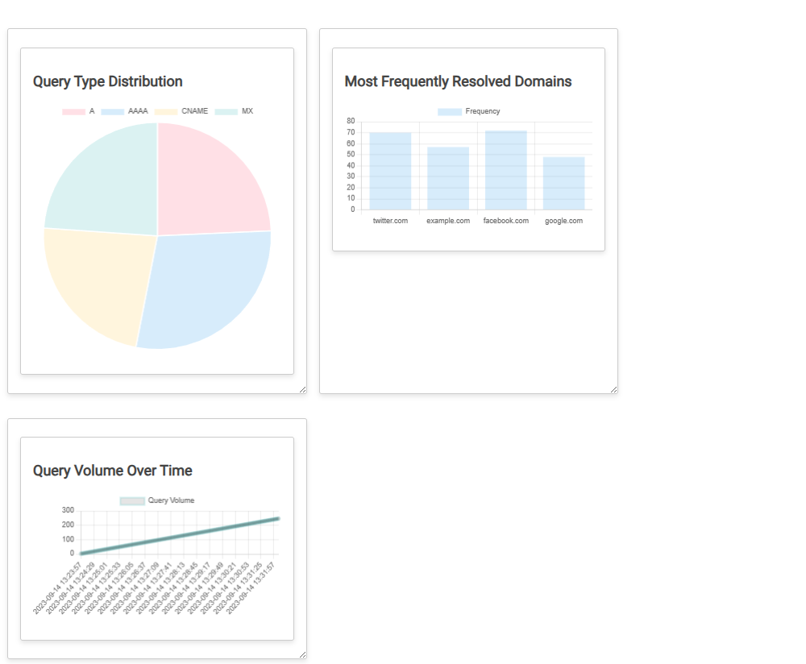

# DNS Dashboard

## Overview

DNS Dashboard is a real-time monitoring tool that provides an eagle-eye view, with drill-down capabilities, of domain name resolution activity within a network. Designed for security analysts, network engineers, and developers, this dashboard offers various visualizations to help easily identify and document anomalies in DNS queries.



## Features

- **Real-Time Visualizations**: Get real-time insights into DNS query types, frequently resolved domains, and query volume over time.
- **Interactive Charts**: Hover over or click on elements within the charts for more information.
- **Resizable Widgets**: Customize the dashboard layout by resizing chart widgets.
- **Query History**: Access the DNS query history for the last 7 days directly within the dashboard.
- **Data Export**: Export collected DNS query data to a CSV file for further analysis.

## Installation

### Prerequisites

- Node.js
- NPM
- Web browser

### Steps

1. Clone the GitHub repository:
    ```bash
    git clone https://github.com/YourUsername/dns-dashboard.git
    ```
2. Navigate to the project directory:
    ```bash
    cd dns-dashboard
    ```
3. Install required Node.js packages:
    ```bash
    npm install
    ```
4. Run the Node.js server:
    ```bash
    node index.js
    ```
5. Open your web browser and go to:
    ```
    http://localhost:3000
    ```

## Usage

After launching the dashboard, you can:

- View real-time DNS query distributions.
- Resize widgets to fit your viewing preferences.
- Click "Show History" to see a table of recent DNS queries.
- Click "Export to CSV" to download the DNS query data.

## Contributing

If you would like to contribute, please fork the repository and submit your changes via a pull request.

## License

This project is licensed under the MIT License. See the [LICENSE.md](LICENSE.md) file for details.

## Acknowledgements

Special thanks to all contributors and supporters of this project.

